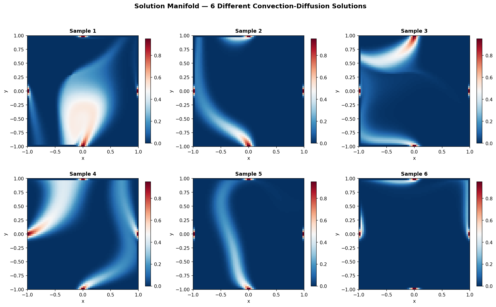
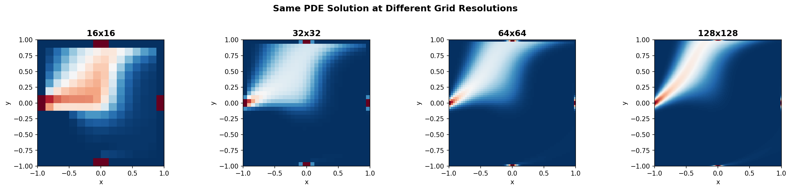

# Latent Representation of PDE Solutions

[](https://doi.org/10.5281/zenodo.19184227)

**NAIC Use Case 7 (UC7)** — Learning compact representations of PDE solution manifolds


> **Key Finding:** Autoencoder-learned latent spaces enable cross-modal transfer between
> PDE solution fields at different grid resolutions and their generating parameters,
> achieving resolution-invariant representations through alignment on the unit hypersphere.

## Overview

Solving PDEs numerically is expensive. For applications that require exploring a
parameterized family of solutions — varying boundary conditions, coefficients, or
discretization resolutions — re-solving the PDE for every configuration is
prohibitive. This project learns a **compact representation of the entire solution
manifold** so that new solutions can be evaluated, interpolated, and compared
without running the solver.

The code solves for a scalar field $u$ (like temperature or concentration) in the steady-state equation:

$$\nabla \cdot (\mathbf{v}u) - \nabla \cdot (D \nabla u) = 0$$

*   **Diffusion ($D$):** Kept constant at 1.0.
*   **Advection ($\mathbf{v}$):** The velocity field is derived from a **Streamfunction** $\psi$, in a way that makes it divergence-free.

Different random streamfunction coefficients produce different
velocity fields, each yielding a different PDE solution.

### Solution Manifold

Each set of streamfunction coefficients produces a unique PDE solution.
Varying these coefficients traces out the **solution manifold** — a structured
space of solutions that autoencoders can learn to represent compactly.



### Multi-Resolution Modalities

The same PDE is solved on multiple grid resolutions (16x16 through 256x256).
These different numerical views are treated as distinct but related **modalities**
that should share a common latent representation.



| Modality | Shape | Description |
|----------|:-----:|-------------|
| u16, u32, u64, u128, u256 | (N, n, n) | Solution fields at each grid resolution |
| Streamfunction coefficients | (N, 14) | Low-dimensional parameters defining the velocity field |
| Latent vectors | (N, 32) | Compact encodings from modality-specific autoencoders |
| Joint latent | (N, 32) | Shared representation on the unit hypersphere |

## Methodology

The pipeline has four stages:

```
                          TRAINING PIPELINE

  PDE Solutions              Streamfunction
  (multi-resolution)         Coefficients
       |                          |
       v                          v
  +------------+           +------------+
  | Encoder_u  |           | Encoder_s  |
  | (conv-AE)  |           | (MLP-AE)   |
  +------------+           +------------+
       |                          |
       v                          v
  [ Latent_u ]             [ Latent_s ]
       |                          |
       +------->  ALIGN  <--------+
                    |
                    v
            [ Joint Latent ]
            (unit hypersphere)
                    |
          +---------+---------+
          v                   v
    +------------+      +------------+
    | Decoder_u  |      | Decoder_s  |
    +------------+      +------------+
          |                   |
          v                   v
     Reconstructed       Reconstructed
     Solutions           Coefficients
```

**Stage 1 — Data Generation** (`cd2d_streamfunc.py`): Sample random
streamfunction coefficients, construct divergence-free velocity fields, and
solve the PDE on multiple grids using finite volumes with `pypardiso`.

**Stage 2 — Modality Autoencoders**: Train independent autoencoders:
- Grid solutions use **convolutional autoencoders** with spatial downsampling
- Streamfunction coefficients use **MLP autoencoders** with latent whitening
- Loss: **Relative Energy Error (REE)** for scale-invariant reconstruction

**Stage 3 — Latent Alignment** (`align_latent_spaces.py`): Map all latents
onto the **unit hypersphere** and define a joint latent as the normalized mean.
This enforces geometric consistency across modalities.

**Stage 4 — Evaluation** (`evaluate_decoder_end_to_end.py`): Measure
reconstruction fidelity via REE per modality and per split. Cross-modal
reconstructions verify semantic consistency.

## Quick Start

### Automated Setup (recommended)

```bash
git clone https://github.com/NAICNO/wp7-UC7-latent-pde-representation.git
cd wp7-UC7-latent-pde-representation
chmod +x setup.sh
./setup.sh
source venv/bin/activate
```

### Run the Full Pipeline

```bash
# 1. Generate PDE data
python src/cd2d_streamfunc.py --n-sol 360 --levels 16 32 64 128

# 2. Create train/val/test splits
python src/create_splits.py --data_dir data

# 3. Train autoencoders
python src/train_solution_autoencoder.py
python src/train_streamfunction_autoencoder.py

# 4. Align latent spaces
python src/align_latent_spaces.py

# 5. Evaluate
python src/evaluate_decoder_end_to_end.py
```

### Interactive Exploration

```bash
jupyter lab  # open demonstrator_pde.ipynb or demonstrator-v1.orchestrator.ipynb
```

### Run Tests

```bash
pytest tests/ -v  # 368 tests
```

### Verify Installation

```bash
python3 -c "import tensorflow as tf; print('TF', tf.__version__); print('GPUs:', tf.config.list_physical_devices('GPU'))"
python3 -c "from pypardiso import spsolve; print('pypardiso OK')"
```

## Project Structure

```
wp7-UC7-latent-pde-representation/
├── README.md                         # This file
├── LICENSE                           # CC BY-NC 4.0 (content) + GPL-3.0 (code)
├── AGENT.md                          # AI agent setup instructions
├── AGENT.yaml                        # Machine-readable agent config
├── setup.sh                          # Automated environment setup
├── vm-init.sh                        # One-time VM initialization
├── requirements.txt                  # Python dependencies
├── requirements-docs.txt             # Sphinx documentation dependencies
├── pytest.ini                        # Test configuration
├── widgets.py                        # Jupyter ipywidgets
├── utils.py                          # Cluster SSH/SLURM utilities
├── Makefile                          # Sphinx build
├── .github/workflows/                # CI/CD pipelines
├── demonstrator_pde.ipynb            # Original notebook (requires TensorFlow)
├── demonstrator-v1.orchestrator.ipynb  # Self-contained demo (numpy/scipy only)
├── src/                              # Core ML pipeline (12 modules)
│   ├── cd2d_streamfunc.py            # PDE data generation
│   ├── create_splits.py              # Train/val/test splits
│   ├── train_solution_autoencoder.py # Conv autoencoder for solutions
│   ├── train_streamfunction_autoencoder.py  # MLP autoencoder for coefficients
│   ├── align_latent_spaces.py        # Latent space alignment
│   ├── analyze_latent_alignment.py   # Alignment diagnostics
│   ├── finetune_encoder_to_latent.py # Encoder fine-tuning
│   ├── finetune_decoder_from_latent.py  # Decoder fine-tuning
│   ├── evaluate_decoder_end_to_end.py   # End-to-end evaluation (REE)
│   ├── compute_errors.py             # Error metrics
│   ├── plot_solutions.py             # Solution visualization
│   └── plot_modalities.py            # Cross-modal visualization
├── tests/                            # 168 pytest tests
├── results/                          # Training outputs
└── content/                          # Sphinx documentation (7 episodes)
    └── images/                       # Result visualizations
```

## Source Modules

| Module | Lines | Description |
|--------|:-----:|-------------|
| `cd2d_streamfunc.py` | 454 | Streamfunction-based PDE data generation with parallel workers |
| `train_solution_autoencoder.py` | 475 | Multi-scale convolutional autoencoders for solution fields |
| `align_latent_spaces.py` | 474 | Hypersphere alignment across modalities |
| `finetune_encoder_to_latent.py` | 365 | Encoder chain fine-tuning toward joint latent |
| `finetune_decoder_from_latent.py` | 301 | Decoder chain fine-tuning from joint latent |
| `evaluate_decoder_end_to_end.py` | 340 | REE-based end-to-end evaluation |
| `compute_errors.py` | 282 | Error metrics and diagnostics |
| `train_streamfunction_autoencoder.py` | 264 | MLP autoencoder with latent whitening |
| `plot_modalities.py` | 242 | Cross-modal reconstruction visualization |
| `analyze_latent_alignment.py` | 236 | Procrustes diagnostics and pairwise REE |
| `create_splits.py` | 184 | Consistent train/val/test split creation |
| `plot_solutions.py` | 134 | Solution field visualization |

## CLI Reference

### Data Generation

```bash
python src/cd2d_streamfunc.py \
    --n-sol 1000 \          # Number of PDE solutions
    --levels 16 32 64 128 \ # Grid resolutions
    --n-sf 4 \              # Streamfunction polynomial degree
    --vel-scale 1e5 \       # Target RMS velocity
    --workers 24 \          # Parallel workers
    --seed 12345            # Random seed
```

### Training

```bash
python src/train_solution_autoencoder.py    # Solution autoencoders
python src/train_streamfunction_autoencoder.py  # Coefficient autoencoder
python src/align_latent_spaces.py           # Latent alignment
python src/finetune_encoder_to_latent.py    # Encoder fine-tuning
python src/finetune_decoder_from_latent.py  # Decoder fine-tuning
```

### Evaluation

```bash
python src/evaluate_decoder_end_to_end.py   # REE per modality/split
python src/analyze_latent_alignment.py      # Alignment quality
python src/compute_errors.py                # Error diagnostics
```

## NAIC Orchestrator VM Deployment

For deployment on NAIC VMs, see [AGENT.md](AGENT.md) for step-by-step instructions.

```bash
# One-time VM setup
./vm-init.sh

# Project setup
./setup.sh
source venv/bin/activate

# Jupyter with SSH tunnel
jupyter lab --no-browser --ip=127.0.0.1 --port=8888

# On your laptop:
ssh -N -L 8888:localhost:8888 -i ~/.ssh/naic-vm.pem ubuntu@<VM_IP>
```

## Documentation

Full tutorial built with Sphinx and deployed to GitHub Pages:

| Episode | Title | Lines |
|:-------:|-------|:-----:|
| 01 | Introduction to PDE Representation | 122 |
| 02 | VM Provisioning | 157 |
| 03 | Setting Up the Environment | 229 |
| 04 | ML Methodology | 188 |
| 05 | Running Experiments | 264 |
| 06 | Analyzing Results | 219 |
| 07 | FAQ and Troubleshooting | 265 |

```bash
pip install -r requirements-docs.txt
make html  # output in build/html/
```

## Troubleshooting

| Issue | Solution |
|-------|----------|
| `No module 'tensorflow'` | `pip install tensorflow[and-cuda]` |
| `No module 'pypardiso'` | `pip install pypardiso` (requires Intel MKL) |
| No GPU detected | Falls back to CPU (slower but functional) |
| OOM on GPU | Reduce batch size or `--n-sol` |
| SSH permission denied | `chmod 600 ~/.ssh/your-key.pem` |
| Data files not found | Run `python src/cd2d_streamfunc.py` first |
| Jupyter not accessible | Check SSH tunnel port |
| Import errors | Activate venv: `source venv/bin/activate` |

## Authors

NAIC Team — Sigma2 / NAIC

## License

- Tutorial content (`content/`, `*.md`, `*.ipynb`): [CC BY-NC 4.0](https://creativecommons.org/licenses/by-nc/4.0/)
- Software code (`*.py`, `*.sh`): [GPL-3.0](https://www.gnu.org/licenses/gpl-3.0.html)

## References

- [NAIC Project](https://naic.no)
- [Sigma2 / NRIS](https://www.sigma2.no)
- Hinton & Salakhutdinov, "Reducing the Dimensionality of Data with Neural Networks" (Science, 2006)
- Standard finite volume formulations for advection-dominated convection-diffusion problems
- Procrustes analysis and manifold alignment for multi-view representation learning
